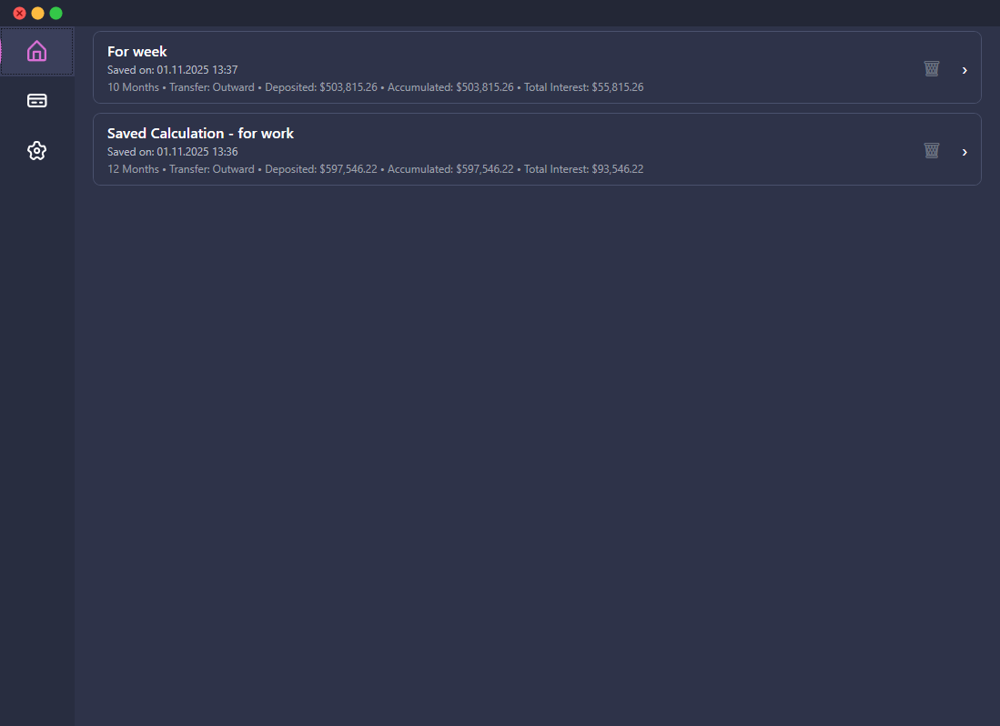
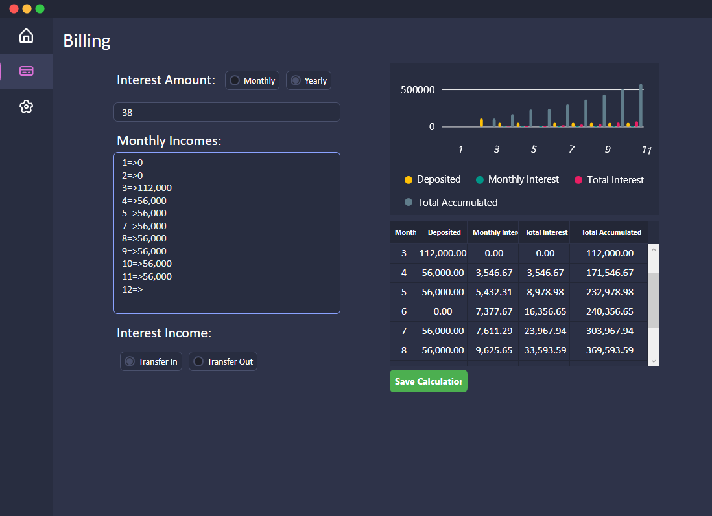

# 💰 RateCalc

**RateCalc** is a clean and efficient desktop application built with **WPF** and **.NET Framework**,  
designed for calculating **interest rates, savings, and investment returns** with precision and clarity.  
It provides users with both quick calculations and detailed monthly result charts for better financial insight.

---

## 🧠 Overview

RateCalc helps users manage and analyze their financial data through intuitive calculation tools.  
Whether you're calculating compound interest, investment growth, or monthly returns,  
RateCalc offers a simple yet powerful interface to handle it all.

---

## ✨ Features

- 💸 **Interest & Savings Calculator** — Easily compute interest rates, investment growth, and monthly returns.  
- 📈 **Dynamic Charts** — Visualize your monthly or yearly growth with automatically generated graphs.  
- 🧮 **Real-Time Updates** — Calculations refresh instantly when values change.  
- 🪟 **WPF Modern Interface** — Clean UI built using Windows Presentation Foundation.  
- 💾 **Local Data Storage** — Save and reload your previous calculations.

---

## 🛠️ Technologies Used

| Category | Technology |
|-----------|-------------|
| Framework | .NET Framework |
| UI Library | WPF (Windows Presentation Foundation) |
| Language | C# |
| Charts | LiveCharts |
| Database | Local File Storage |
| Platform | Windows Desktop |
| IDE | Visual Studio 2022 |

---

## 📸 Screenshots

Below are some screenshots from the current version of **RateCalc**.

| Main Calculator Page | Monthly Chart View |
|------------------------|--------------------|
|  |  |

> 💡 *The interface was designed with minimalism and clarity in mind, making financial calculations accessible to everyone.*

---

## 🚀 Installation

1. Download the setup file from the repository:  
   [📦 RateCalcSetup/RateCalcSetup.msi](./RateCalcSetup/Release/RateCalcSetup.msi)

2. Run the installer and follow the on-screen instructions.

3. Once installed, open **RateCalc** from your Start Menu or Desktop shortcut.

> 💡 *If you prefer to view or modify the source code, you can still clone the repository and open `RateCalc.sln` in Visual Studio.*

